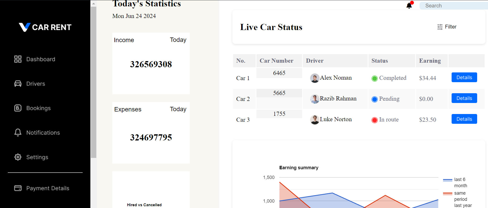

# Dashboard-Web-Application

This repository contains the code for a dashboard web application. The application features interactive charts, a live car status table, and various sections for income and expense tracking, car availability, and more.

## Features

- **Interactive Charts**: Uses Google Charts to display earning summaries and status overviews.
- **Live Car Status**: A table displaying the live status of cars, including their drivers, status, and earnings.
- **Dynamic Date Display**: Displays the current date on the dashboard.
- **Fetch API Integration**: Fetches data from external APIs and displays it dynamically on the dashboard.
- **Responsive Design**: Ensures the dashboard is user-friendly across different devices.
- **Navigation Bar**: Includes links to various sections like dashboard, drivers, bookings, notifications, settings, payments, and transactions.
- **Car Availability Checker**: Allows users to check car availability by selecting car number, date, and time.

## Getting Started

### Prerequisites

- A web browser
- Internet connection to load external scripts and APIs

### Installation

1. Clone the repository:
    ```sh
    git clone https://github.com/prachisaur/Dashboard-Web-Application.git
    ```
2. Navigate to the project directory:
    ```sh
    cd Dashboard-Web-Application
    ```
3. Open `index.html` in your web browser.

### Usage

- Open the `index.html` file in your web browser to view the dashboard.
- Navigate through the different sections using the navigation bar on the left.
- View the live car status, earning summary, and various statistics dynamically updated from external data sources.

## File Structure

- `index.html`: The main HTML file for the dashboard.
- `style.css`: The CSS file for styling the dashboard.
- `script.js`: The JavaScript file for additional client-side functionality.

## External Libraries and APIs

- **Google Charts**: Used for displaying interactive charts.
- **FontAwesome**: Used for icons in the navigation bar.
- **DataUSA API**: Used to fetch income and expense data.

## Screenshots



## Contributing

Contributions are welcome! Please open an issue or submit a pull request for any improvements or bug fixes.

## License

This project is licensed under the MIT License. See the `LICENSE` file for more information.

## Acknowledgments

- [Google Charts](https://developers.google.com/chart)
- [FontAwesome](https://fontawesome.com/)
- [DataUSA API](https://datausa.io/api)
